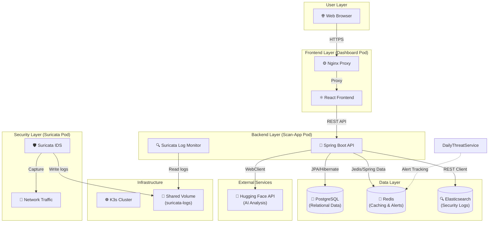
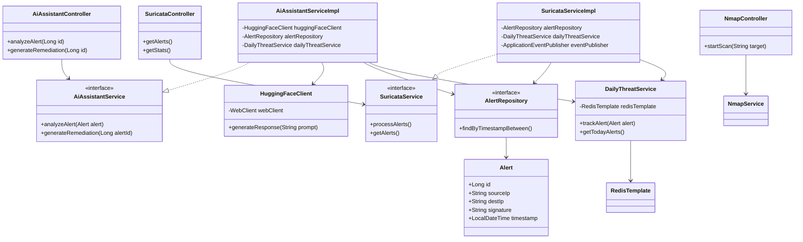

# Project Architecture Documentation

This document provides a comprehensive overview of the project's architecture, including the technology stack, pod communication, and class structure.

## 🏗️ System Architecture

The following diagram illustrates the high-level system architecture, showing the interaction between the different components and technologies.

## 📊 Class Diagram (Backend)

The following class diagram represents the core logic of the `scan-app` backend, showing the relationships between controllers, services, repositories, and entities.

## 🛠️ Technology Stack

| Component | Technology |
| :--- | :--- |
| **Frontend** | React, Vite, TypeScript, Tailwind CSS, Recharts |
| **Backend** | Java 21, Spring Boot 3, Maven |
| **Database** | PostgreSQL (Relational), Redis (NoSQL/Cache) |
| **Search Engine** | Elasticsearch |
| **Security** | Suricata (IDS), Nmap (Scanner) |
| **AI** | Hugging Face (Mistral-7B) |
| **Infrastructure** | Docker, K3s (Kubernetes), Nginx |
| **OS** | Linux (Ubuntu/Debian) |
